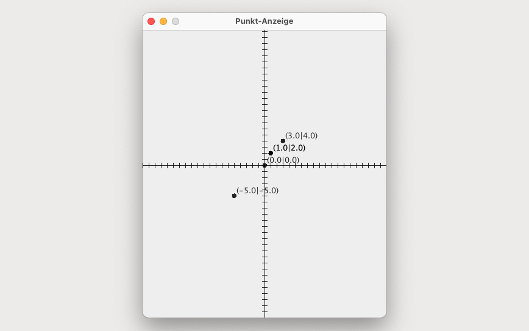

# PunktTester (Main)

This program is designed to model and manipulate points on a two-dimensional plane. It allows users to create points with specified or default coordinates, access and modify the coordinates, and compare if two points are the same. Additionally, the program provides a graphical representation of the points using a Display class, which can show or hide points in a coordinate system. Users can also create a third point with custom coordinates and move an existing point to the new point's location to verify if both points are now identical on the plane.

## GUI



## Terminal Output

```bash
Startwert Punkt 2: (1.0|2.0)X: 1.0| Y: 2.0
Startwert Punkt 3: (3.0|4.0)X: 1.0| Y: 2.0
Startwert Punkt 4: (0.0|0.0)X: 1.0| Y: 2.0

Versetzen P1 nach (5|6):
Wert Punkt 1: (5.0|6.0)

Verschieben P1 mit (-4|-4):
Wert Punkt 1: (1.0|2.0)

Vergleichen P1 mit P2:
Beide Punkte sind identisch

Geben sie bitte einen X-Wert fuer P5 an:
5
Geben sie bitte einen Y-Wert fuer P5 an:
5

Wert Punkt 1: (5.0|5.0)

Spiegeln Punkt p5
Wert Punkt 5: (-5.0|-5.0)

Abstand P3 zum Koordinatenursprung
5.0

Winkel P3 zur X-Achse
53.13010235415599 Grad

Zum anzeigen der GUI bestaetige mit y
y
```
