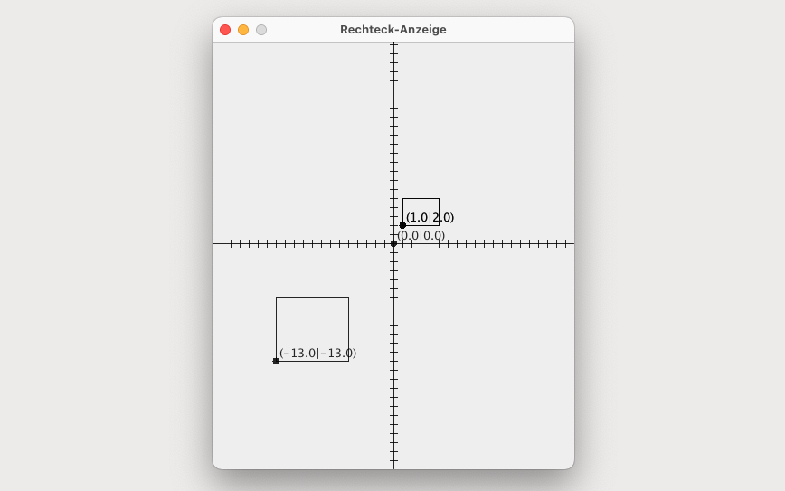

# RechteckTester (Main)

## GUI



## Terminal Output

```bash
Startwerte Rechteck 1: Startpunkt: (1.0|2.0), Hoehe: 3.0, Breite: 4.0
Startwerte Rechteck 2: Startpunkt: (1.0|2.0), Hoehe: 3.0, Breite: 4.0
Startwerte Rechteck 3: Startpunkt: (5.0|6.0), Hoehe: 7.0, Breite: 8.0
Startwerte Rechteck 4: Startpunkt: (0.0|0.0), Hoehe: 0.0, Breite: 0.0

Rechteck 1 versetzen nach (5|6)
Werte Rechteck 1: Startpunkt: (5.0|6.0), Hoehe: 3.0, Breite: 4.0

Rechteck 1 verschieben um (-4|-4)
Werte Rechteck 1: Startpunkt: (1.0|2.0), Hoehe: 3.0, Breite: 4.0

Vergleich Rechteck R1 mit R2:
Rechteck R1 gleich R2

Eckpunkte Rechteck R1: 
Alpha: (1.0|2.0), Beta: (1.0|6.0), Gamma: (4.0|6.0), Delta: (4.0|2.0)

Spiegeln Rechteck R3: 
Werte Rechteck R3: Startpunkt: (-13.0|-13.0), Hoehe: 7.0, Breite: 8.0

Vergleich Rechteck R1 mit R2: 
Punkt Alpha gleich
Punk Beta gleich
Punkt Gamma gleich
Punkt Delta gleich
Zum anzeigen der GUI bestaetige mit y
y
```