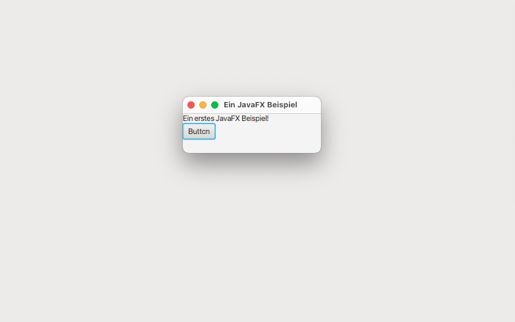
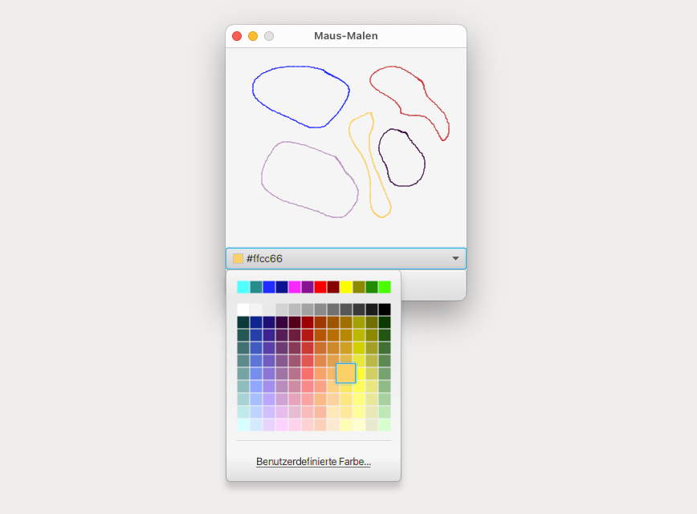

# EinErstesBeispiel (Main)

Initial program for setting up a JavaFX window with button and a close function, which serves as the foundation for the painting application.

## GUI

# FensterErschaffen (Main)

The framework for the JavaFX window with custom styling properties and a Canvas object, enabling users to draw within the application.

## GUI

# MausMalen (Main)

This program creates an interactive drawing application where users can click and drag the mouse within a graphical window. The application features a Canvas drawing object and uses GraphicsContext for handling colors and shapes. MouseEvent handling is used for detecting mouse clicks and drags. The program also includes a painting program called MousePainting that connects points while dragging the mouse. Additional features include changing paint colors using a ColorPicker, clearing the canvas with a button, and styling the delete button with an icon and custom code.

## GUI

