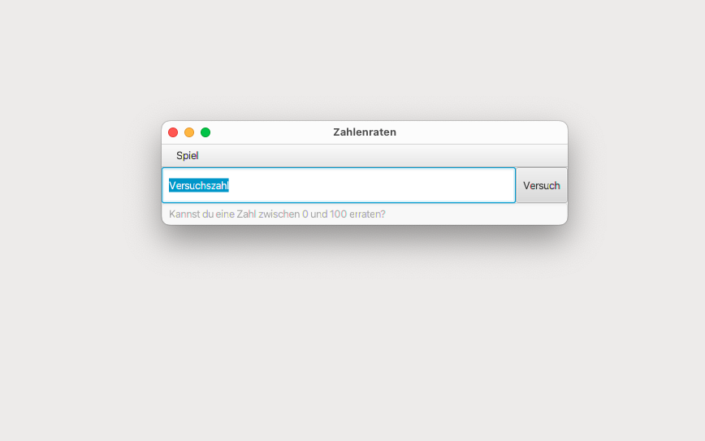
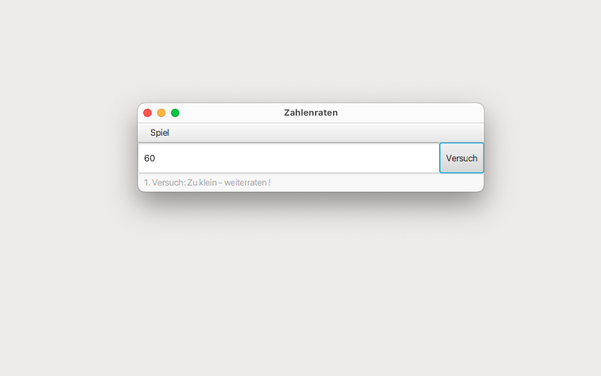
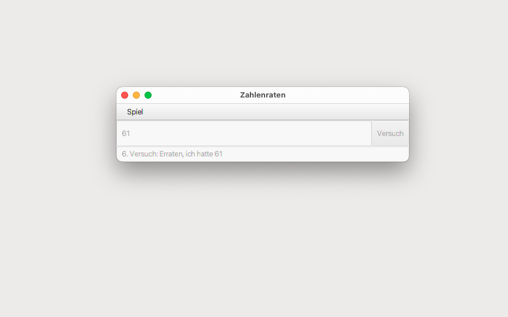

# ZahlenRateSpiel (main)

This number-guessing game features a graphical user interface where a player takes turns guessing a number between 0 and 100. The program includes a menu bar with options for starting or ending a new game. Additional buttons are nested in a VBox layout for ease of use. The game surface can be locked after a correct guess, preventing further input until a new game is started. The program also counts and displays the number of attempts made by the user during the game.

## GUI





# RateSpiel (Main)

## Terminal Output

```bash
Kannst Du eine Zahl zwischen 0 und 100 erraten?

Versuchszahl ? 50
Zu klein - weiterraten !
Versuchszahl ? 75
Zu klein - weiterraten !
Versuchszahl ? 90
Zu gross - weiterraten !
Versuchszahl ? 80
Zu klein - weiterraten !
Versuchszahl ? 85
Zu gross - weiterraten !
Versuchszahl ? 84
Zu gross - weiterraten !
Versuchszahl ? 83
Zu gross - weiterraten !
Versuchszahl ? 82
Zu gross - weiterraten !
Versuchszahl ? 81
Erraten, ich hatte 81
```
