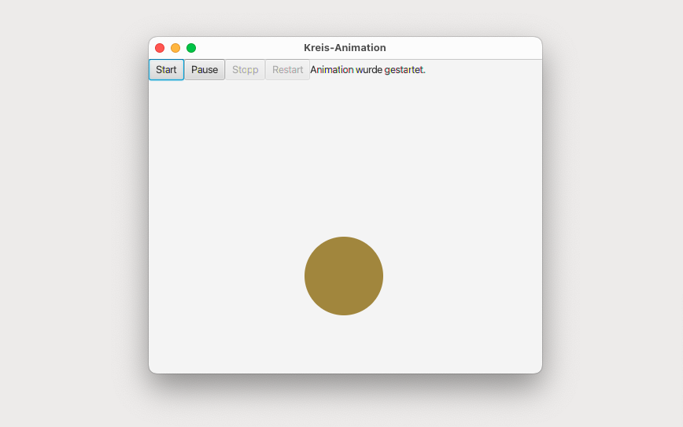
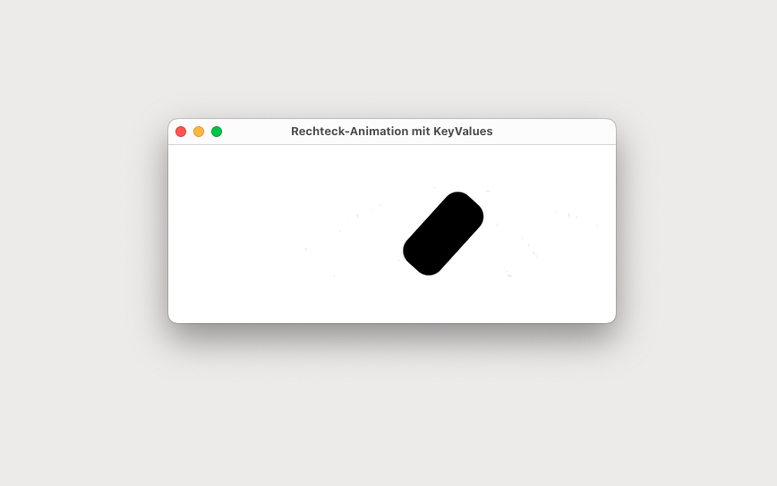

# Creation of Animations

Animations in JavaFX provide a dynamic and interactive user experience by changing the properties of graphical elements over time. JavaFX offers a range of predefined animations and transitions, allowing developers to create complex animations easily. Using TimelineTransitions, KeyValues, and event handlers, developers can manipulate writable properties, create keyframes, and trigger events to control the flow of animations. The following programs are implementations that mess around with different properties.

## KreisAnimation (Main)

This program animates a ball that moves in all directions within a specified space, changing direction when it hits the edges. The animation uses event handlers and KeyValues to control the ball's movement. The application includes buttons for user control, allowing them to start, pause, stop, and restart the animation. Additionally, a label indicates the last button pressed by the user.

### GUI

## RechteckAnimation (Main)

This program animates a rectangle along the x-axis, rotates it 360 degrees, and changes the radius of its corners. The animation uses the KeyValue class and repeats infinitely while automatically reversing direction. The rectangle moves within a 500x200 pixel pane, and the entire animation runs for 2 seconds.

### GUI

