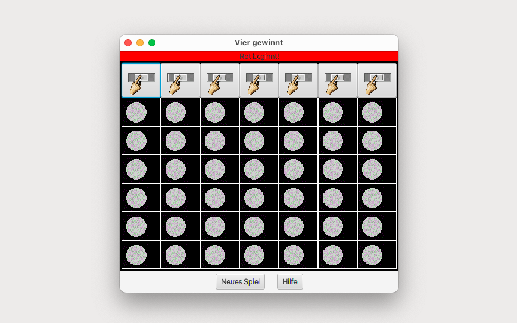

# VierGewinnt (Main)

This program implements a graphical user interface for the popular game Connect Four. The interface includes a grid-based game board with a column selection mechanism, a display to indicate which player's turn it is, and buttons for starting a new game or accessing help. The game logic checks for winning conditions and manages player turns. A modal help window containing an in-app web browser displays the Wikipedia page for the game to provide additional information.

## GUI

